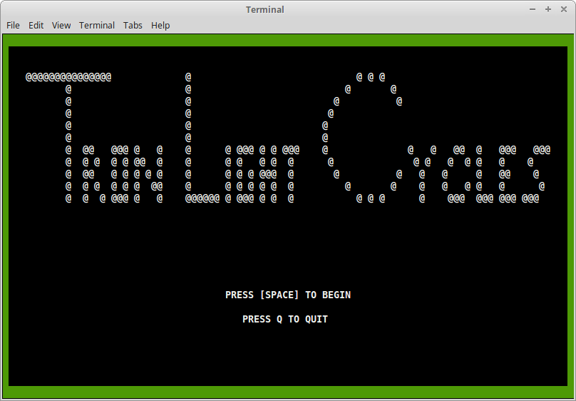
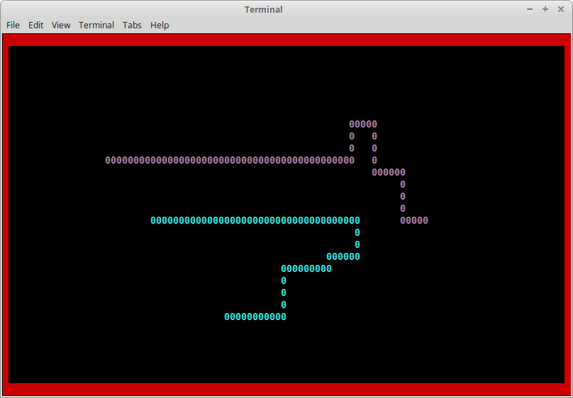

# Tron-Light-Cycles-Online

An implementation of the Tron Light Cycles game.
The graphics are text based and were designed using `ncurses`.

It is a LAN multiplayer game.
Server and client were written using `socket`.

Runs on Linux and Mac.

# Dependencies

`ncurses` is required to play the game.

| OS / Distro    | Installation                          |
| -------------- | ------------------------------------- |
| Mac            | Should be included in the [XCode Tools](https://developer.apple.com/library/mac/documentation/Darwin/Reference/ManPages/man3/ncurses.3x.html).|
| Ubuntu/Debian  | `apt-get install libncurses5-dev`     |
| Fedora         | `yum install ncurses-devel`           |

#  Installation

Simply run `make` to create the server and the client executables.

# Starting the Game

1. `./lco-server` to first start the server.
2. `./lco-client` to start the game client.

The game will begin after two clients have connected to the server.

Note: When running client from a different host, you must provide the server host's IP Address. See below.

# Optional Arguments

`lco-server [portnum]`

- `portnum` A port for the server to run on. Default value is 1337.

`lco-client [ipaddr] [portnum]`

- `ipadds` IP Address of the server's host machine. Loopback address by default.
- `portnum` Port number of server on specified machine. Default value is 1337.

